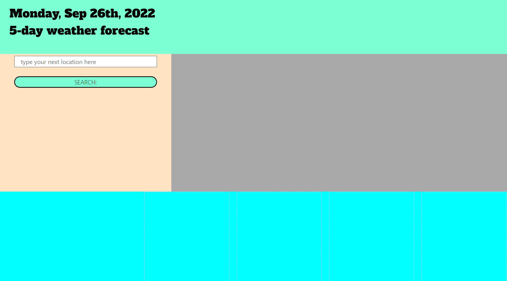
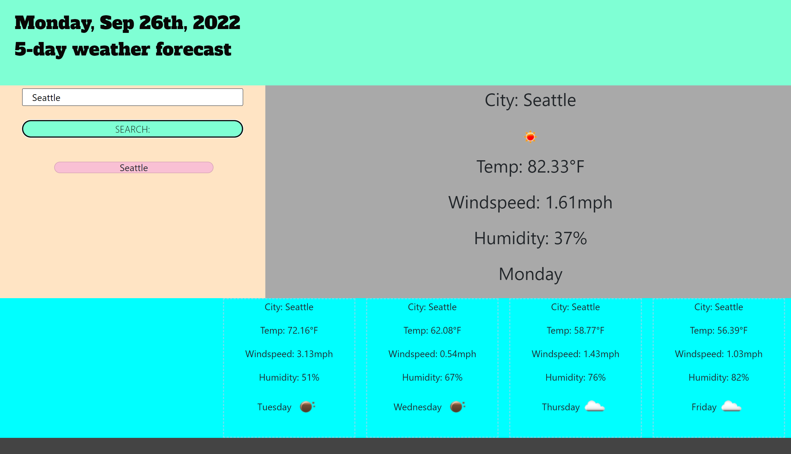
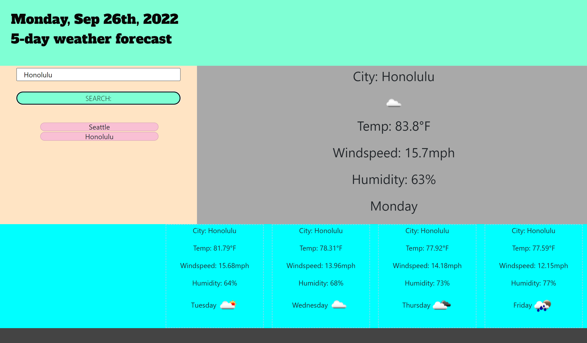

# weather-or-not

## Description

I was tasked with creating a weather app that performed and fetch request to the https://openweathermap.org/api in ogre to accomplish this task I used a secondary api from https://www.geoapify.com/ to pull the latitude and longitude for each location the user inputs.  This assignment was a challenge since there was no code provided.  I enjoyed styling and laying out the HTML and I got a lot more comfortable dynamically creating elements with JQUERY.  This task challenged me to really understand what a fetch request to an API is capable of.  It took a lot of effort to extract the data and display it but I am quite pleased at how it turned out.

*UPDATE
I was getting an error emssage due to the API that was not recommended.  I wanted to avoid this error message in my console so I dug in and was able to work out how to do 2 API calls and get the data that I needed!  This means I am no longer using the "geoapify" but since it was a major part of how I solved my issues to start I wanted to keep the relevant info in this file as a record of my progress and thinking. 

## Installation 

https://tbarns.github.io/weather-or-not/

## Usage 

 
 
  

## Credits
I crafted the HTML, CSS and JavaScript file with JQuery.
-additional technology used includes google fonts, moment.js and bootstrap

## License

MIT License

Copyright (c) 2022 Timothy Barnaby

Permission is hereby granted, free of charge, to any person obtaining a copy
of this software and associated documentation files (the "Software"), to deal
in the Software without restriction, including without limitation the rights
to use, copy, modify, merge, publish, distribute, sublicense, and/or sell
copies of the Software, and to permit persons to whom the Software is
furnished to do so, subject to the following conditions:

The above copyright notice and this permission notice shall be included in all
copies or substantial portions of the Software.

THE SOFTWARE IS PROVIDED "AS IS", WITHOUT WARRANTY OF ANY KIND, EXPRESS OR
IMPLIED, INCLUDING BUT NOT LIMITED TO THE WARRANTIES OF MERCHANTABILITY,
FITNESS FOR A PARTICULAR PURPOSE AND NONINFRINGEMENT. IN NO EVENT SHALL THE
AUTHORS OR COPYRIGHT HOLDERS BE LIABLE FOR ANY CLAIM, DAMAGES OR OTHER
LIABILITY, WHETHER IN AN ACTION OF CONTRACT, TORT OR OTHERWISE, ARISING FROM,
OUT OF OR IN CONNECTION WITH THE SOFTWARE OR THE USE OR OTHER DEALINGS IN THE
SOFTWARE.
